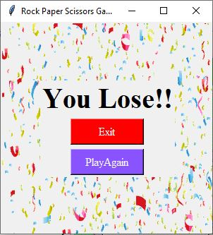

# Rock-Paper-Scissors-Game
Rock Paper Scissors Game made using tkinter in python
## Components :-
- <ins>Login/Signup Page</ins> - using database(sqlite), gives popup if the username or password is wrong.
- <ins> Welcome Page </ins> - Changes the image based on user's gender
- <ins>Game Page</ins> - using buttons in tkinter, scoreboard
- <ins>Result Page</ins> - tells if you won or lost
- <ins>Leaderboard Page</ins> - using database(sqlite), light and dark mode

## To run the project :-
1. Fork the repository.
2. Download the repository using github desktop or directly download it.
3. Open it with either pycharm or any other IDE. <ins>Note:- The libraries like sqlite, tkinter, PIL, random should be downloaded in your pc.</ins>
4. Run the functions create() and LeaderboardCreate() to create the .db file.
5. Run the file called LoginSignupForm.py.

>  **Additional Information :-** You can change the number of plays in one set by changing the value of variable "turns"  

## Screenshots :- 
 
 
 
 
 
 
 
 

## **FORK it to USE it** :wink:
> In case the images don't load check the path of the images in the code.
> If there is any issue with the availability of library, download it using pip install.
